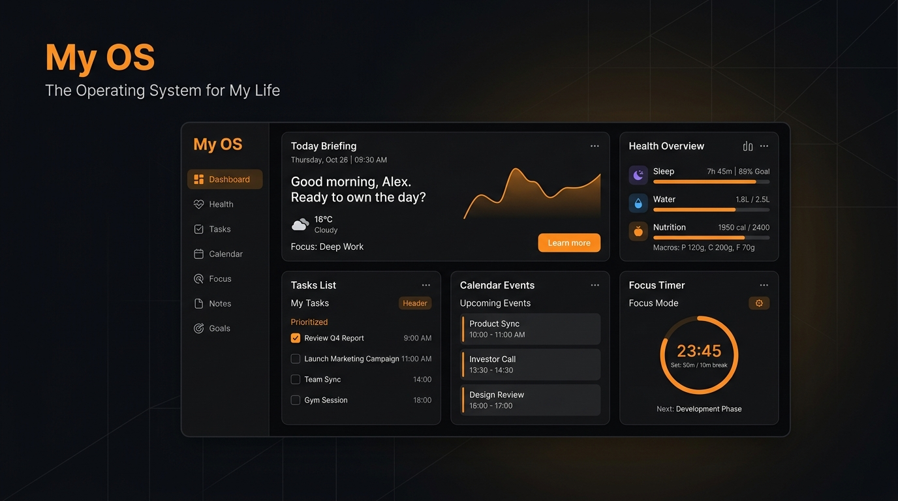
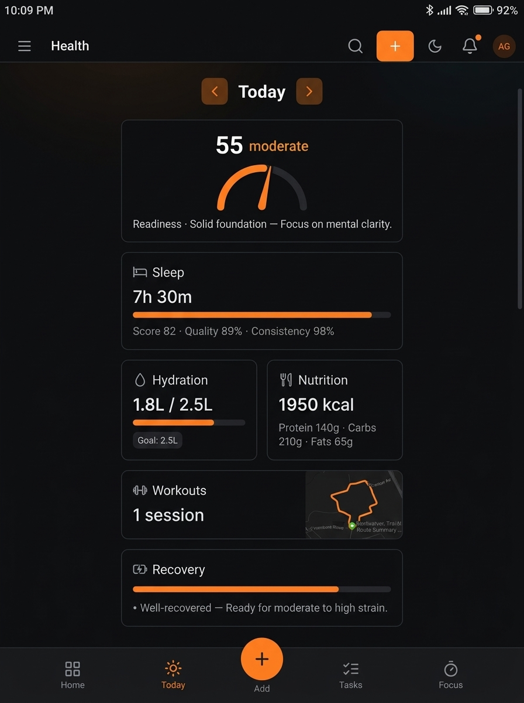

<div align="center">



# My OS

**The Operating System for My Life.**

*A single-user, self-hosted, AI-augmented personal operating system built with production-quality engineering.*

[](https://www.typescriptlang.org/)
[](https://nextjs.org/)
[](https://www.postgresql.org/)
[](https://www.docker.com/)
[](#)

</div>

---

## What is My OS?

Most people run their lives across ten disconnected apps — a calendar here, a todo list there, a habit tracker, a notes app, a finance spreadsheet. Context lives in the gaps between them and is constantly lost.

**My OS replaces all of that with one private, intelligent system.**

It answers a single question better than anything else:

> **"What should I be doing right now?"**

Every screen, every background job, every AI recommendation exists to make that answer more accurate, more timely, and more trustworthy. Think of it as mission control for your life — a calm, precise chief of staff that organizes, prioritizes, and recommends, but never acts without your explicit approval.

---

## The Philosophy

| Principle | What it means in practice |
|-----------|--------------------------|
| **Decisions, not dashboards** | Every stat arrives with its next action. Not "8 overdue tasks" — "Finish 3 · Ignore 5." |
| **Capture is sacred** | Logging anything takes ≤ 3 interactions. Quick-capture is one shortcut away from anywhere. |
| **Data compounds** | A water log is trivial. A year of sleep, mood, workout, and nutrition data is self-knowledge. |
| **AI proposes, you decide** | Every AI-originated change to tasks, events, plans, or health records is a proposal you explicitly accept or reject. The AI never silently mutates important data. |
| **Calm technology** | Notifications are a scarce resource. Quiet hours are respected absolutely. Focus Mode makes the whole system go quiet on command. |
| **Beautiful is functional** | Density, typography, and speed (Linear/Arc/Raycast lineage) aren't decoration — they're what makes a daily-driver tool livable. |

---

## Features

<table>
<tr>
<td width="50%" valign="top">

### 🧠 Intelligence
- **Today Briefing** — morning mission control: priorities, energy, schedule, and one recommended focus block
- **AI Chief of Staff** — answers questions over your own data with citations ("When did I last work on X?")
- **Predictive signals** — deadline risk, habit slippage, budget overrun, before they happen
- **Adaptive seasons** — reweights plans for exam week, internship crunch, gym cut, or travel without reconfiguration

### ✅ Productivity
- **Tasks & Projects** — priority scoring, deadline tracking, blocking relationships
- **Planner** — AI-generated daily plan you review and accept in under 60 seconds
- **Calendar** — events, time blocks, free-time awareness
- **Focus Mode** — Pomodoro-style deep work with the whole system going quiet
- **Inbox** — anything that has no home yet lands here to be organized later

</td>
<td width="50%" valign="top">

### 💚 Health
- **Sleep** — duration, score, debt, consistency — daily-scoped, date-navigable
- **Nutrition** — calorie and macro tracking with meal logging
- **Hydration** — water intake vs. goal with quick-add shortcuts
- **Workouts** — type, duration, RPE, calories burned
- **Readiness score** — deterministic daily score synthesizing sleep, recovery, and energy
- **History view** — browse any past day's complete health picture

### 💰 Finance & Life
- **Finance** — expenses, budgets, savings tracking
- **Journal** — daily reflections with AI pattern detection
- **Life Timeline** — a written record of your life you'll value in ten years
- **Goals** — long-horizon targets with progress tracking
- **Knowledge vault** — notes, resources, and references

</td>
</tr>
</table>

---

## Screenshots

<div align="center">

### Health — Daily Wellness Dashboard
*Navigate any past day to review sleep, food, water, and exercise history*



</div>

---

## Stack

```
Language      TypeScript 5.7
Frontend      Next.js 15 (App Router) · React 19 · Tailwind CSS v4
API           tRPC v11 (end-to-end type-safe)
Database      PostgreSQL 16 + pgvector · Drizzle ORM
Jobs          pg-boss (Postgres-backed queue — no Redis)
AI            Anthropic Claude · OpenAI · Gemini · Groq · Local (provider-agnostic)
Auth          Auth.js (NextAuth v5) · Clerk
Infra         Docker Compose · Caddy · Cloudflare Tunnel (optional)
Tooling       pnpm workspaces · Turborepo · ESLint · Prettier · Vitest
```

**Import direction** (enforced by ESLint):
`ui → ∅ · shared → ∅ · core → shared · db → shared · ai → core/db/shared · apps → all`

---

## Repository Layout

```
apps/
  web/          Next.js app — UI, tRPC API, SSE, 35+ page sections
  mobile/       Capacitor Android shell (WebView → deployed web app)
  worker/       Node worker — jobs, schedulers, notifications, backups

packages/
  ui/           Design system — tokens, components, animations
  db/           Drizzle schema, migrations, query helpers
  core/         Pure domain logic (no IO) — 25+ deterministic modules
  shared/       Zod schemas, env validation, constants
  ai/           Provider-agnostic AI platform

infra/          Docker Compose, Caddy, Dockerfiles, runbooks, backup scripts
docs/           Architecture specs, ADRs, design system, release notes
scripts/        Ops scripts — update, backup, restore, status
```

---

## Getting Started

### Prerequisites

- **Node ≥ 22** — `node --version`
- **pnpm ≥ 9** — `corepack enable`
- **Docker + Docker Compose** — for local Postgres

### Local Development

```bash
# 1. Clone and install
git clone https://github.com/ArnavGarg7/My-OS.git
cd My-OS
corepack enable
pnpm install

# 2. Configure environment
cp .env.example .env
# Edit .env — defaults work for local dev out of the box

# 3. Start Postgres
docker compose -f infra/compose.dev.yml up -d

# 4. Run migrations
pnpm db:migrate
pnpm db:check           # verify connectivity

# 5. Start the app (two terminals)
pnpm dev                # → http://localhost:3000
pnpm worker:dev         # background jobs + notifications
```

### Common Scripts

| Command | Description |
|---------|-------------|
| `pnpm dev` | Web app in watch mode |
| `pnpm worker:dev` | Worker process in watch mode |
| `pnpm build` | Build all packages and apps |
| `pnpm lint` | ESLint across the workspace |
| `pnpm typecheck` | `tsc --noEmit` across the workspace |
| `pnpm format` | Prettier (write) |
| `pnpm format:check` | Prettier (check only) |
| `pnpm db:migrate` | Apply Drizzle migrations |
| `pnpm db:check` | Verify database connectivity |
| `pnpm db:studio` | Open Drizzle Studio |

---

## Production Deployment

Single-VPS self-hosted deployment with Docker Compose + Caddy.

```bash
# 1. Copy and fill in secrets
cp .env.example .env

# 2. Deploy (includes DB backup → image build → migrate → health check)
powershell -ExecutionPolicy Bypass -File scripts\ops\update.ps1
```

The update script is a safe rolling deploy:
1. `git pull` the latest
2. Backup the database (safety net)
3. Build updated Docker images
4. Run migrations
5. Start all services
6. Wait for the health endpoint to confirm success

For remote public access via Cloudflare Tunnel (no open inbound ports):
```bash
# Add MYOS_TUNNEL_TOKEN to .env, then:
docker compose --env-file .env -f infra/docker-compose.yml --profile tunnel up -d --build
```

### Ops Scripts

| Script | Purpose |
|--------|---------|
| `scripts/ops/update.ps1` | Full safe update workflow |
| `scripts/ops/backup.ps1` | Database backup to `./backups/` |
| `scripts/ops/restore.ps1` | Restore from a backup |
| `scripts/ops/status.ps1` | Check container + DB health |

---

## Architecture Highlights

- **No Redis** — job queue runs on pg-boss (Postgres-backed), keeping the stack minimal
- **No multi-tenancy complexity** — optimized for exactly one user, clean enough to scale later
- **AI is optional infrastructure** — the app is fully usable with AI disabled; AI multiplies value but is never a single point of failure
- **Schema-first design** — every feature is designed database-first; `docs/specs/05_Database_Design.md` is the source of truth
- **Boring technology, deliberate exceptions** — proven mainstream stack; only "exotic" dependencies are pgvector and AI SDKs, both isolated behind interfaces
- **Autonomous Intelligence stack** — Event Intelligence → Predictive Intelligence → Proposal-First Automation → External Connectors → Adaptive Personal Intelligence

---

## Documentation

Full design and architecture is specified across nine documents in [`docs/specs/`](docs/specs/):

| Document | Contents |
|----------|----------|
| `01_Vision.md` | Why it exists, philosophy, product identity |
| `02_Product_Requirements_Document.md` | Every feature, workflow, interaction, edge case |
| `03_Design_Requirements_Document.md` | Design system, every page/component/state/animation |
| `04_System_Architecture.md` | Frontend, backend, workers, scheduling, notifications, auth |
| `05_Database_Design.md` | Complete relational schema, indexes, data flow, backups |
| `06_AI_Architecture.md` | Planner, context engine, prioritizer, memory, prompts |
| `07_Implementation_Roadmap.md` | Staged build plan — each stage independently testable |
| `08_Developer_Guidelines.md` | Folder structure, naming, git standards, testing |
| `09_Future_Versions.md` | Deliberately excluded ideas for V2+ |

---

## Privacy

- **Single user. Self-hosted.** Your data lives in your database on infrastructure you control.
- The only data that leaves the system goes to your chosen AI provider (scoped to minimum context per request).
- **No analytics, no telemetry, no third-party trackers.**
- A local-only mode toggle disables all external AI calls and degrades gracefully.

---

<div align="center">

*Built with the conviction that your life deserves better software than a collection of disconnected apps.*

</div>
