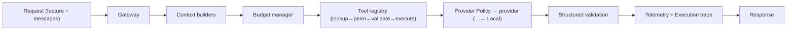

# AI Pipeline

Every AI request flows through one pipeline ([ADR-006](../adr/ADR-006.md), [ADR-007](../adr/ADR-007.md), [ADR-009](../adr/ADR-009.md)).

- Provider selection is capability-driven and always terminates in **Local** ([ADR-002](../adr/ADR-002.md), [ADR-005](../adr/ADR-005.md)).
- A complete, replayable trace is recorded for every request.
