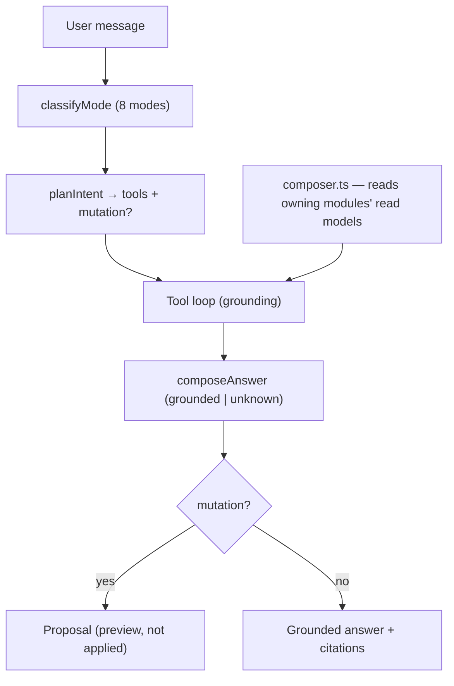

# Chief & Conversational Pipeline

The Chief composes read models ([ADR-003](../adr/ADR-003.md)); the assistant grounds every answer in tool results and returns proposals for mutations ([ADR-004](../adr/ADR-004.md)).

- The Now Engine, Morning Intelligence, Optimize/Rescue/Night all run on the same composed `ChiefContext`.
- Provider is resolved by the Provider Policy; offline → Local.
