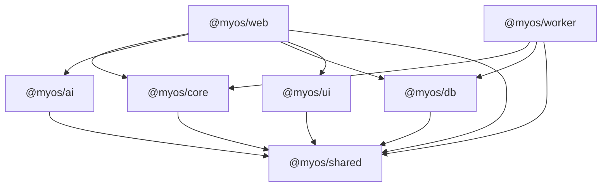

# Dependency Graph

Package-level dependency direction (generated + validated by `scripts/dependency-graph.mjs` and `scripts/export-validator.mjs`). No cycles; no forbidden edges.

**Forbidden (asserted in CI):**
- `@myos/core` → `@myos/ai` / `@myos/db` / any server (core is pure).
- `@myos/ai` → `@myos/core` / `@myos/db` (AI consumes read models via the server seam only).
- any deep import (`@myos/x/src/...`) or undeclared subpath.
