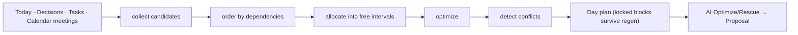

# Planner Pipeline

The Planner is deterministic orchestration ([ADR-001](../adr/ADR-001.md)) — it turns work + fixed commitments into a timeline. AI never edits the plan directly ([ADR-004](../adr/ADR-004.md)).

- Calendar meetings enter as **fixed** blocks (source of truth for time).
- Regeneration preserves locked blocks; proposals are previews the user accepts.
