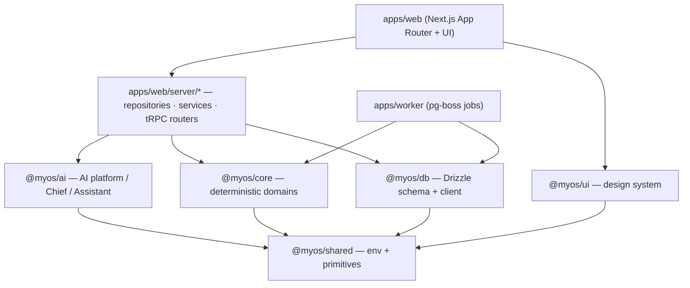

# System Architecture

The layered architecture. Dependencies point **downward** only — a higher layer never imported by a lower one. Enforced by `scripts/dependency-graph.mjs` + `scripts/export-validator.mjs`.

- **The server layer is the only seam** that composes core + AI + DB.
- `@myos/ai` imports **no** business domain and **no** DB — cloud clients + persistence are injected server-side.
- `@myos/core` is pure and imports only `@myos/shared`.
